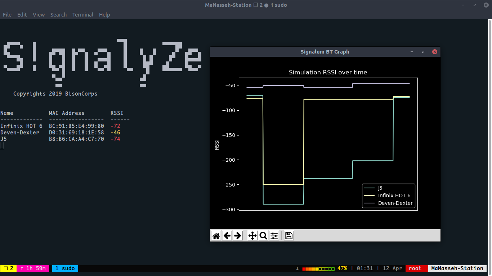

# Signalum

A Linux Package to detect and analyze existing connections from wifi and bluetooth

[](https://travis-ci.com/bisoncorps/signalum)
[](https://opensource.org/licenses/MIT)
[](https://badge.fury.io/py/Signalum)

- [Signalum](#signalum)
  - [Installation](#installation)
  - [Development](#development)
  - [Usage](#usage)
  - [Contribution](#contribution)
  - [License (MIT)](#license-mit)

## Installation

```bash
    pip install signalum
```

## Development

```bash
    git clone git@github.com:bisoncorps/signalum.git

    sudo apt-get install bluetooth libbluetooth-dev

    pip install requirements.txt

```


## Usage

Signalum comes with a cli tool called `signalyze`


```bash
  ▄▄▄▄    ▄                         ▀▀█           ▄▄▄▄▄▄
 █▀   ▀   █     ▄▄▄▄  ▄ ▄▄    ▄▄▄     █    ▄   ▄      █▀  ▄▄▄
 ▀█▄▄▄    █    █▀ ▀█  █▀  █  ▀   █    █    ▀▄ ▄▀    ▄█   █▀  █
     ▀█   ▀    █   █  █   █  ▄▀▀▀█    █     █▄█    ▄▀    █▀▀▀▀
 ▀▄▄▄█▀   █    ▀█▄▀█  █   █  ▀▄▄▀█    ▀▄▄   ▀█    ██▄▄▄▄ ▀█▄▄▀
                ▄  █                        ▄▀
                 ▀▀                        ▀▀
                 ▀▀                        ▀▀
   usage: signalyze [-h] [-p PROTOCOL] [-o OUTPUT] ([--show-graph] OR [--show-extra-info]) [--show-name]

  optional arguments:
    -h, --help            show this help message and exit
    -p PROTOCOL, --protocol PROTOCOL
                          A protocol to analyze (default: all)
    --show-graph          Show Realtime graph of nearby devices
    -o OUTPUT, --output OUTPUT
                          path to store output csv file
    --show-name           Show Device name and mac address

```


## Contribution

You are very welcome to modify and use them in your own projects.

## License (MIT)

This project is opened under the [MIT 2.0 License](https://github.com/bisoncorps/signalum/blob/master/LICENSE) which allows very broad use for both academic and commercial purposes.
